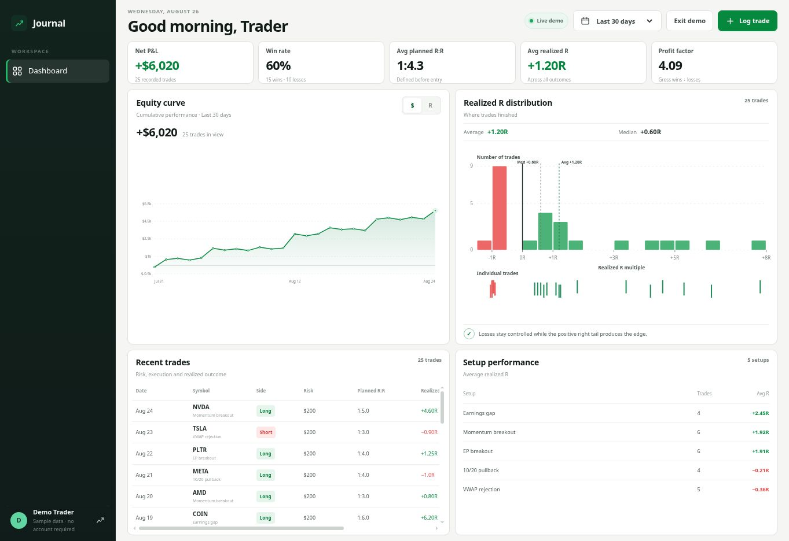

# Brontide

<p align="center">
  
</p>

<p align="center">
  An open-source trading system for catalyst discovery, charting, risk-aware execution and post-trade learning.
</p>

<p align="center">
  <a href="https://melvinroy.github.io/Journal/?demo=1"><strong>Explore the live demo</strong></a>
  ·
  <a href="docs/SELF_HOSTING.md">Self-host in five minutes</a>
  ·
  <a href="SECURITY.md">Security model</a>
</p>

<p align="center">
  
  
  
  
</p>

## See your edge, not just your P&L

<p align="center">
  
</p>

- **Cumulative equity curve** in dollars or R
- **Continuous realized-R histogram** with exact individual-trade markers
- **Risk-aware journaling** with planned R:R, dollar risk and automatic realized R
- **Date-range analytics** for 30 days, 90 days, year-to-date and all time
- **Private cloud synchronization** across devices
- **Secure email authentication** and password recovery
- **Responsive one-screen workstation** for desktop, tablet and mobile
- **Built-in demo mode** with realistic sample trades
- **Dual-cap position sizing** using account risk and maximum symbol allocation

## Trade, Catalyst, Scans, Backtest and Journal workspace

The signed-in application has five primary tabs:

- **Journal** — private trades, equity curve, realized-R distribution and setup performance
- **Catalyst** — Today / 3-day / 5-day signal windows, bullish and bearish leadership, theme concentration, searchable canonical inventory and ticker drill-down
- **Scans** — date-filtered EP contraction candidates from the current 2× volume-expansion research rule
- **Backtest** — strategy registry, comparison metrics, rule definitions and plain-language interpretation
- **Trade** — compact long/short position sizing, Low-of-Day or manual stops, persistent risk defaults and a staged post-fill exit plan

The Catalyst dashboard reads the de-duplicated Table 3 feed from the read-only `catalyst_dashboard_rows` view. If that optional feed has not been installed or populated in a self-hosted Supabase project, the Journal remains fully operational and the Catalyst tab shows a clear unavailable state.

## Trade execution roadmap

- **Phase 1 — Planner:** calculate integer shares from the smaller of the risk-based and allocation-based limits; save preferences and trade plans locally. No broker order is sent.
- **Phase 2 — IBKR entry:** connect through the TWS API, load account and market data, preview orders and submit an entry with one full-position protective stop.
- **Phase 3 — Post-fill management:** respond to confirmed executions, create profit-taking and runner orders, resize remaining protection after fills and reconcile broker state after reconnects.

The multi-exit plan is deliberately not attached to the entry in Phase 1. It is staged for deployment only after a confirmed fill.

## Your deployment. Your data.

Every self-hosted installation uses its own GitHub Pages website and its own Supabase project. No trades pass through a shared application server.

| Layer | Purpose |
| --- | --- |
| Next.js static frontend | Dashboard, charts and trade logging |
| GitHub Pages | Free public hosting for the application |
| Supabase Auth | Account creation, sessions and recovery |
| Supabase Postgres | Private trade storage |
| Row-Level Security | Ensures each account can access only its own trades |

The browser receives only a Supabase **publishable key**. Database passwords, secret keys and service-role credentials are never placed in the application.

## Self-host your journal

1. Select **Fork** at the top of this repository.
2. Create a free [Supabase project](https://supabase.com/dashboard/new).
3. Run the included database installer once.
4. Add your Supabase URL and publishable key as GitHub repository variables.
5. Configure the GitHub Pages address in Supabase Auth.
6. Enable GitHub Pages using **GitHub Actions**.

A new fork without configuration opens the visual **Owner Setup** assistant instead of showing a broken login page.

[Open the complete self-hosting guide →](docs/SELF_HOSTING.md)

<p align="center">
  
</p>

## Database upgrades

The schema is versioned under `supabase/migrations/`. The initial migration creates the trade table, index, trigger and ownership policies. Future versions add new timestamped migrations without deleting existing data.

For automated upgrades, connect the fork through the Supabase GitHub integration. For local deployment:

```bash
supabase login
supabase link --project-ref YOUR_PROJECT_ID
supabase db push --dry-run
supabase db push
```

## Local development

```bash
git clone https://github.com/YOUR_USERNAME/Journal.git
cd Journal
cp .env.example .env.local
npm ci
npm run dev
```

Then add your own public Supabase URL and publishable key to `.env.local`.

## Contributing

Issues and pull requests are welcome. Read [CONTRIBUTING.md](CONTRIBUTING.md) before proposing schema or authentication changes.

## License

Released under the [MIT License](LICENSE).
