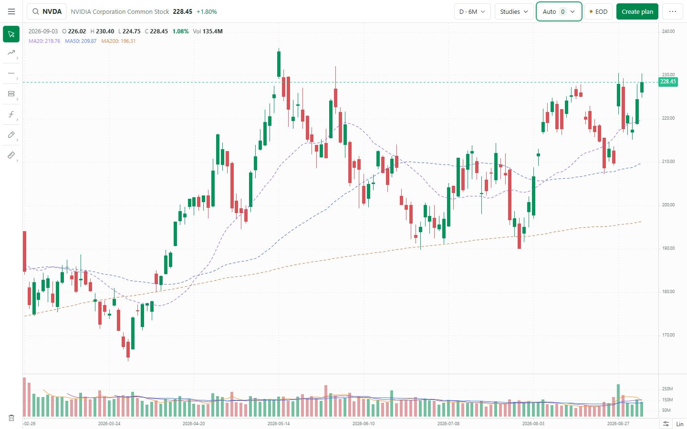
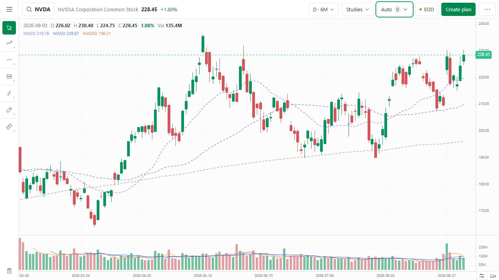
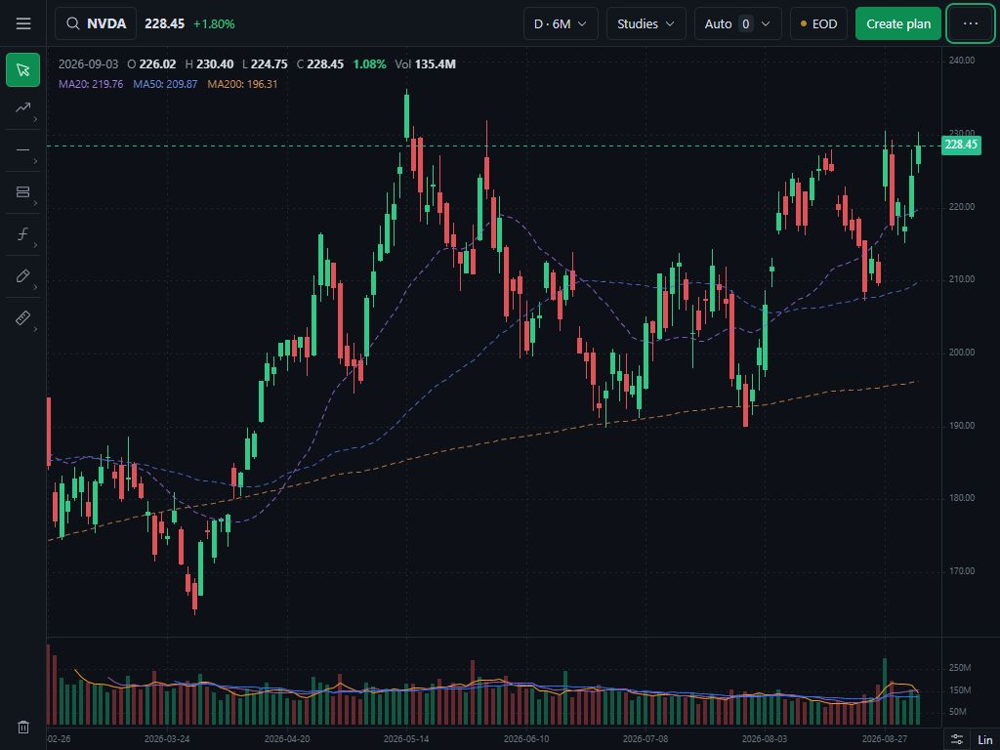
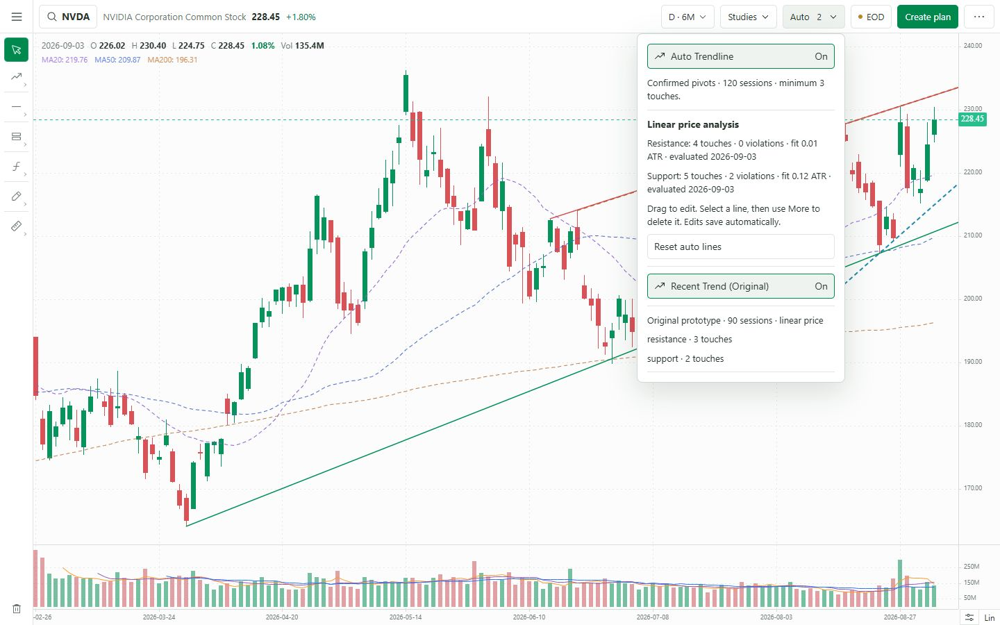
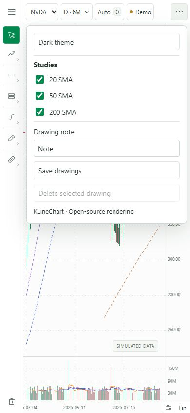

# Phase 1 — chart layout review

Status: QC passed; awaiting user review and release approval. No merge or deployment to main. Phases 2–5 have not started.

## Delivered

- One 48px command row and one 48px full-height drawing rail.
- Full-viewport Charts mode, with main and recovered workspace navigation available from the top-left menu.
- Removed chart watchlist and reserved column, permanent source/note/evidence rows, and footer. Existing saved watchlists are untouched.
- Consolidated Daily and existing date ranges into one Time popover; no unsupported weekly option.
- Studies, both existing trendline engines and their evidence, data freshness/adjustment/refresh, drawing note/save/delete, and theme remain accessible through popovers.
- Lin/Log and one viewport-menu button share the bottom-right axis corner. View offers zoom in/out, backward, latest, and fit selected range.
- Replaced the 20% future-space allocation with a compact 8–30px margin. Fitted charts refit on resize; deliberate pan/zoom is preserved.
- Added a compact last-close/previous-close change readout. Existing candle OHLC and candle open-to-close change remain on the canvas.
- Popovers close on outside click and Escape, restoring trigger focus on Escape. At phone widths, Studies and Create plan move into More.

## Exact release scope

Application changes: `app/ChartDashboard.tsx`, `app/ChartMenu.tsx`, `app/chart-workspace.css`, and the ChartDashboard navigation wiring in `app/page.tsx`.

This folder contains the review evidence. No chart-data API, algorithm, storage key, dependency, database, hosting configuration, or deployment workflow changes. Unrelated `next.config.ts` and pre-existing `output/` contents are excluded.

## Verification

| Check | Result |
|---|---|
| Local EOD production build (`BRONTIDE_LOCAL_BUILD=1 npm run build`) | Pass, including TypeScript and static export |
| GitHub Pages production build (`BRONTIDE_LOCAL_BUILD=0 npm run build`) | Pass, including TypeScript and static export |
| Pages build served locally under `/Journal/charts/` | Pass; simulated chart, assets and controls loaded; no browser console errors |
| `node --test tests/chart-data.test.mjs tests/auto-trendlines.test.mjs tests/workspace-state.test.mjs tests/ui-recovery.test.mjs` | 22 passed, 0 failed |
| 1440×900, 1280×720, 1024×768 | Pass; single row, chart reaches bottom/right edge, sidebar hidden, no page overflow |
| 390×844 additional compact check | Pass after moving Studies into More; final More menu accessible |
| Dark/light themes | Pass |
| 6M → 1M → 6M | Pass; range label and candles update; Escape returns focus to Time |
| Studies toggling | Pass; 20 SMA disappears/reappears in legend and chart |
| Both trendline controls | Pass; active count and evidence update without changing layout |
| Lin/Log; zoom in/out; backward/latest/fit | Pass; scale and viewport update |
| Local search NVDA → MRNA | Pass; selected stock and bars update |
| Create plan from MRNA | Pass; Trading shows `New plan · MRNA`; no trading record created |
| Raw-price selection | Pass; unavailable raw series produces explicit empty state, not simulated prices |
| Restore adjusted series | Pass; real bars return |
| Drawing rail / save / selection / deletion | Pass with a temporary horizontal line in sample mode |
| Drawing persistence across ticker changes | Pass; sample NVDA line returns after switching to MRNA and back; test line subsequently removed |
| Main navigation returns after leaving Charts | Pass |
| Git whitespace check | Pass |

Builds and UI checks were performed on 7 September 2026. Desktop dimensions were checked with browser viewport overrides and DOM bounds; overrides were reset afterward. Screenshots show actual rendered charts rather than generated mockups.

## Limits and existing data conditions

- Local data reported calendar/freshness uncertainty and had no raw NVDA series. These existing conditions remain visible in the Data menu and empty state.
- Daily is the supported candle interval. Weekly aggregation, new drawing tools, a unified trendline algorithm, setup metrics, and new pattern detection belong to later phases.
- No public deployment has been performed. After approval: merge this phase, verify GitHub Actions/Pages, smoke-test the deployed chart, then start Phase 2.
- Keyboard dismissal/focus and ordinary desktop/phone layouts were checked. This is not a full assistive-technology or accessibility certification.

## Screenshots

### 1440×900 — light

### 1280×720 — light

### 1024×768 — dark

### Auto evidence stays in a popover

### 390×844 — compact More menu

## Release checkpoint

Review the chart layout and control placement. Approval authorizes this phase's merge to main and deployment verification. Requested adjustments remain in Phase 1 and receive targeted QC before release.
