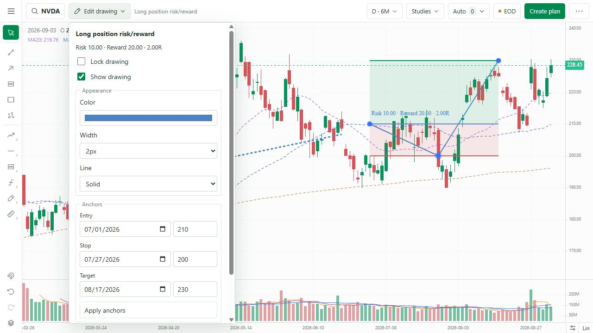
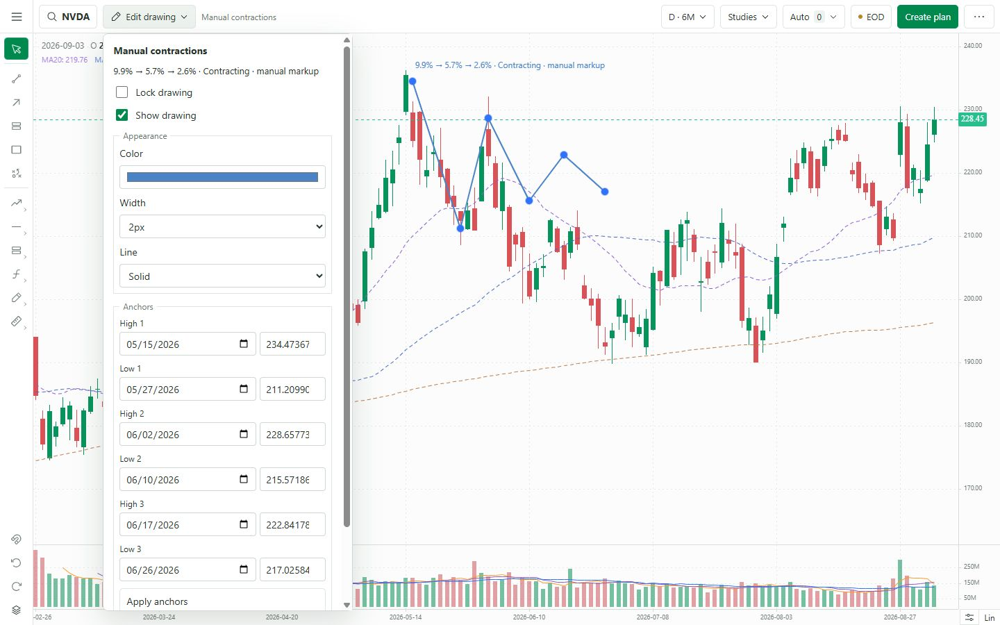
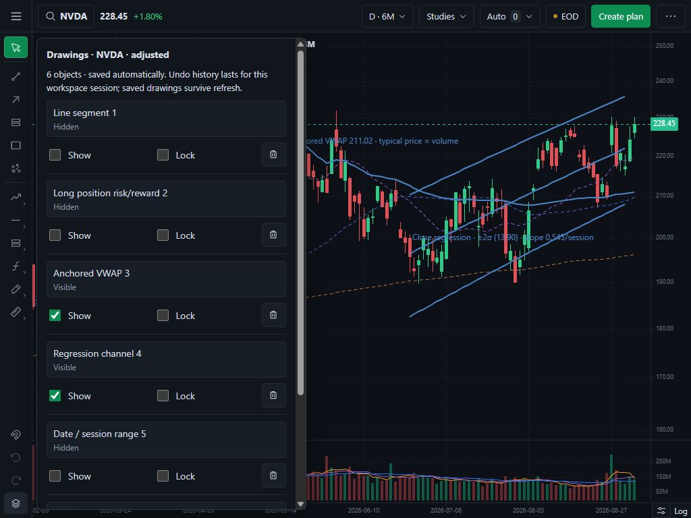
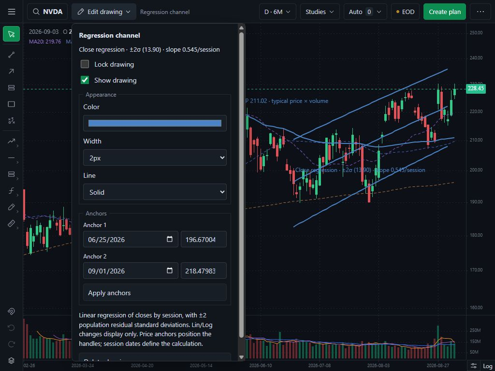
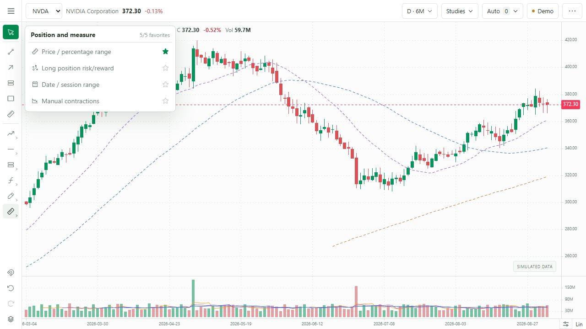

# Phase 2 — drawing workflow review

Status: superseded as an approval packet by the 7 September 2026 remediation specification. Its results remain retained evidence, but Phase 2 is not complete. See the [Gate 2A as-built inventory and reconciliation](as-built-inventory.md).

Branch: `codex/chart-phase-2-drawings`, based on Phase 1's released merge commit `fd6e934c2085d4a1639246f2bbbd29c3525585ac`.

Phase 1 was approved by the request to move to Phase 2. [PR #1](https://github.com/Melvinroy/Journal/pull/1) was merged, [Pages deployment 34063396837](https://github.com/Melvinroy/Journal/actions/runs/34063396837) succeeded, and the published `/Journal/charts/` chart was smoke-tested before this phase began.

## What changed

- Retained the grouped tools and added five customizable favorites. Defaults: segment, horizontal ray, parallel channel, rectangle, and price/percentage range. Pin/unpin controls live beside each tool.
- Added snapping to candle OHLC, undo/redo, Escape cancellation, and an Objects menu to select, show/hide, lock, delete, and clear unlocked manual drawings. Clear/delete are undoable; right-click selects instead of invoking the renderer's destructive default.
- Selected drawings use an **Edit drawing** control in the existing top row. The editor supports color, width, line style, exact session/price anchors, and annotation text. No additional permanent toolbar or panel.
- Added long-position risk/reward, inclusive session/calendar measurement, three-contraction manual markup, daily anchored VWAP, and a close-regression channel.
- Kept the version-1 drawing storage key and array format compatible, with additive appearance/visibility fields. History is isolated by source, symbol, and price adjustment. Theme, visible range, and Lin/Log do not reset it. Corrupt reads and conflicting writes retain saved data.

## Calculation definitions and limits

| Tool | Definition |
|---|---|
| Long position | Risk = entry − stop; reward = target − entry; R = reward/risk. Requires 0 < stop < entry < target. Per-share price distances, excluding fees/slippage. |
| Date/session range | Counts supplied EOD sessions inclusively; separately reports intervals and elapsed calendar days. Requires two loaded sessions in chronological order. |
| Manual contractions | Six chronological high/low anchors. Each depth = (high − low)/high; "Contracting" requires strictly decreasing depths. This is annotation evidence, not automated VCP qualification. |
| Anchored VWAP | Cumulative `(high + low + close)/3 × volume`, divided by cumulative volume, from the selected session through the last supplied bar. Daily approximation; missing volume or zero cumulative volume is explicitly unavailable. |
| Regression channel | OLS of closes against session indices over the selected dates. Center plus/minus twice the population standard deviation of residuals. At least three sessions. Calculation stays in price space on Lin and Log displays. |

New anchors use loaded sessions. Drawings whose saved dates are outside supplied history remain stored and accessible in Objects, with an explicit unavailable state. They are not silently moved onto other sessions. Raw and adjusted drawings are separate; no automatic corporate-action conversion is attempted. Drawing tools belong to the price pane.

Undo/redo retains up to 50 changes per chart context during the mounted workspace session. Saved geometry, appearance, visibility, and locks survive page refresh; the undo stack does not. Automatic trendlines retain their existing separate edit/reset workflow in Auto. No detection engine or broker execution was added.

## QC results

| Check | Result |
|---|---|
| Production Pages build (`BRONTIDE_LOCAL_BUILD=0`) | Pass: static export and TypeScript checks |
| Production local build (`BRONTIDE_LOCAL_BUILD=1`) | Pass: static export and TypeScript checks |
| Existing + new focused tests | 32/32 pass, including 10 drawing tests |
| 1440×900, 1280×720, 1024×768 | Pass: 48px single toolbar, 48px rail, chart reaches viewport bottom, document dimensions equal viewport, no page scrolling or toolbar wrapping |
| Light/dark and Lin/Log | Pass: editor, native controls, Objects, saved geometry; regression evidence unchanged at ±2σ 13.90 and slope 0.545/session in the inspected NVDA example |
| Placement and exact editing | Pass: segment, ray, text note, risk/reward, date range, VWAP, regression, and six-anchor contraction placement; appearance and exact price/date editing |
| Drag/undo | Pass: contraction anchor moved from May 15 to May 19 and changed first depth from 9.9% to 8.8%; one undo restored original anchors and 9.9% |
| Lock/hide/delete/restore | Pass: locked edits/delete disabled; hidden objects remain editable in Objects; delete/undo restores; clear preserves locked objects; one undo restores the cleared set |
| Favorites and snapping | Pass: pin/unpin and refresh persistence; ray snapped to 219.86, matching the supplied August 20 NVDA candle high |
| Keyboard and cancellation | Pass: Ctrl-Z and Ctrl-Shift-Z undo/redo a text edit; Escape discards an unfinished rectangle without saving it |
| Wrong-pane protection | Pass: a volume-pane VWAP click is rejected with an explicit message and leaves zero saved objects; subsequent candle-pane placement succeeds. This renderer edge case was found, fixed, and retested during QC. |
| Refresh and contexts | Pass: six drawings restored with visibility/lock/style state; EOD refresh retained drawings; MRNA and raw NVDA showed separate empty collections; adjusted NVDA restored its six objects |
| Visible-range independence | Pass: anchored VWAP stayed at 211.02 when changing 6M to 1M with its May anchor offscreen |
| Date validation | Pass: a weekend date is rejected without replacing saved anchors; valid session dates save. Native date submission bug found during QC was fixed and retested. |
| Chart navigation / plan handoff | Pass: Create plan navigated to Trading with `New plan · NVDA`; returned to Charts without creating a plan |
| Pages `/Journal/charts/` smoke test | Pass: rendering, menus, note edit, undo/redo, cancellation, and cleanup; no browser console errors |

Tests:

```powershell
node --test tests/drawing-workspace.test.mjs tests/chart-data.test.mjs tests/auto-trendlines.test.mjs tests/workspace-state.test.mjs tests/ui-recovery.test.mjs
```

Known data limitation: local raw NVDA has no stored bars, so isolation and disabled placement were tested in that state. Adjusted local EOD and the Pages sample dataset were both exercised. Existing local freshness/calendar warnings remain visible.

Temporary QC drawings were removed through the undoable UI. The local preview returns to NVDA, adjusted EOD, 6M, light theme, linear scale, snapping off, and the default favorites. No user trade records were created. Existing `next.config.ts` and untracked `output/` remain outside this change set.

## Screenshots

The annotations below are deliberate QC examples, not generated trading recommendations.











## Proposed release contents

- `app/ChartDashboard.tsx`: grouped tools, favorites, contextual editor, object controls, history/snapping shortcuts.
- `app/DrawingEditor.tsx`: manual drawing editor and visible evidence.
- `app/chart-workspace.css`: rail, editor, Objects, and native theme styling.
- `lib/drawing-workspace.ts`: storage migration, history transitions, calculation definitions and unavailable states.
- `lib/use-drawing-workspace.ts`: explicit persistence, conflict protection, per-context history.
- `lib/use-drawing-controller.ts`: renderer lifecycle, placement/edit callbacks, cancellation, and restoration.
- `lib/chart-overlays.ts`: five new drawing overlays.
- `tests/drawing-workspace.test.mjs`: focused migration/history/calculation tests.
- This review packet and five screenshots.

Release gate: stop here for owner review. Merge this phase only after approval, verify its Pages deployment and published chart, then begin Phase 3.
