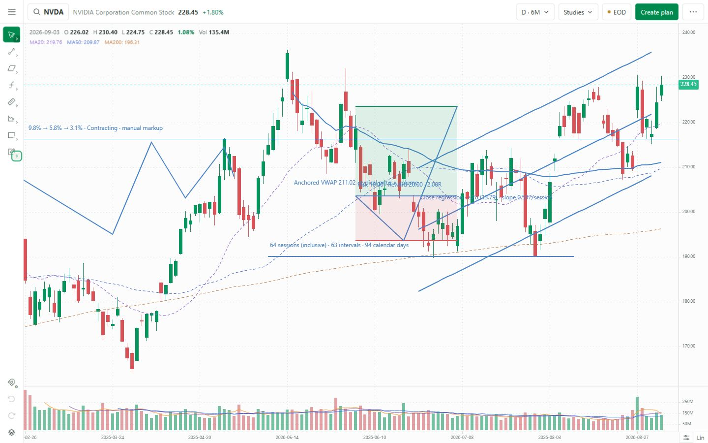
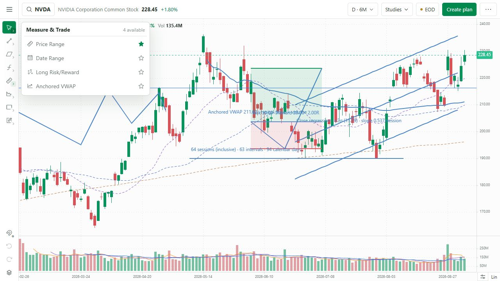
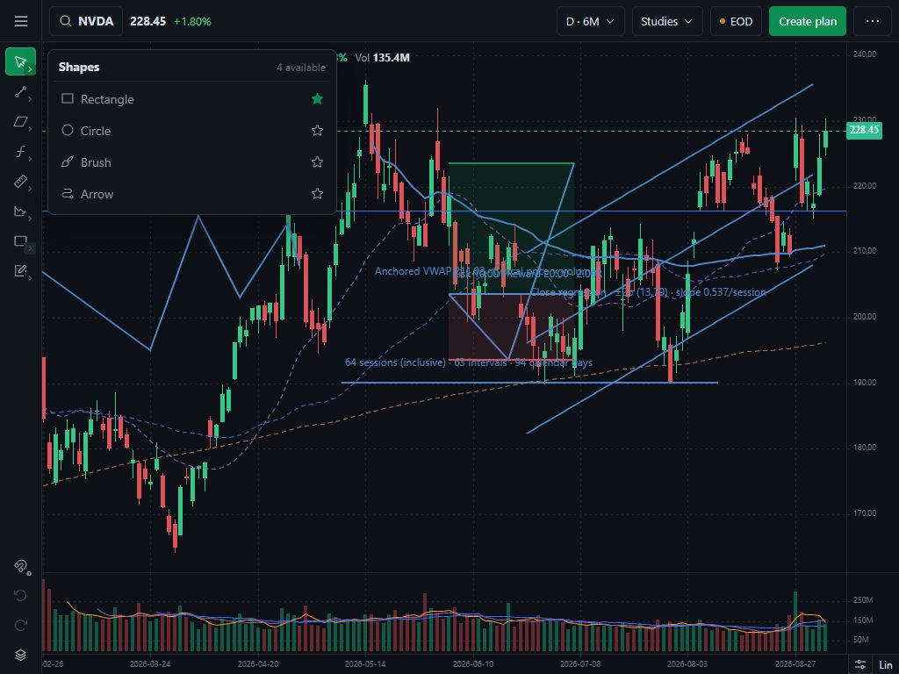

# Phase 2B — canonical registry and compact rail

Status: implemented and validated; awaiting the Gate 2B owner decision. PR #2 remains draft and unmerged.

Baseline: Gate 2A inventory commit `47351e91a8c95971adc32d7e73b95a254f079806`.

## Delivered structure

- One typed registry in `lib/drawing-tools.ts` owns all 29 approved canonical IDs, unique labels, unique Phosphor icon keys, one of eight fixed groups, renderer mapping, legacy aliases, shortcuts, and default last-used tools.
- The desktop rail renders exactly eight fixed group slots and four fixed utilities. It no longer renders favourite tools as a second rail strip.
- Clicking a group’s main icon activates its persisted last-used available tool. A separate 14 px chevron inside the same slot opens the group flyout without changing group order.
- Every available tool in a flyout has one star action. Favourites sort first only inside their owning group and appear once.
- Tool and group-button accessible names match their tooltips and include group context. Select/Crosshair also exposes its `Esc` shortcut.
- Each different approved tool has a distinct icon component in the canonical registry. Available controls were also reviewed visually in light and dark themes.
- The existing Auto Trendline and Recent Trend controls and overlays are hidden. Their `brontide-auto:*` and `brontide-recent-v1:*` records are still read but are never deleted or rewritten by this change.

## Available inventory at this gate

The registry contains the complete approved 29-tool architecture. Gate 2B exposes only the 21 entries that already have a working implementation basis, including Select/Crosshair. This avoids presenting unfinished controls as completed features.

| Group | Available at Gate 2B |
|---|---|
| Cursor | Select/Crosshair |
| Lines | Trend Line, Horizontal Ray, Ray, Extended Line, Horizontal Line, Vertical Line |
| Channels | Parallel Channel, Regression Channel |
| Fibonacci | Fibonacci Retracement |
| Measure & Trade | Price Range, Date Range, Long Risk/Reward, Anchored VWAP |
| Patterns & Setups | Manual Contraction/VCP Markup |
| Shapes | Rectangle, Circle, Brush, Arrow |
| Annotations | Note, Price Note/Label |

Eraser, Info Line, Flat Top/Bottom Channel, Trend-Based Fibonacci Extension, Date & Price Range, Highlighter, Text, and Callout remain registry-owned but are absent from creation flyouts until Gate 2D implements them.

## Migration and data preservation

- The global `brontide-drawing-preferences-v2` record stores schema version, favourites, group last-used choices, recent tools, Keep Drawing state, and Off/Weak/Strong snap state.
- On first load, known IDs from `brontide-drawing-favorites-v1` are translated to canonical IDs. The old Boolean snap value maps `false` to Off and `true` to Strong; a device with no prior value defaults to Weak.
- The v1 preference keys are left untouched for rollback. Invalid or unreadable data produces an explicit warning and is not overwritten.
- Existing drawing records remain in their current v1 store at this gate. The four approved legacy removals—Horizontal Segment, Vertical Ray, Vertical Segment, and Price Line—have no creation buttons, but saved objects continue to restore through KLineChart and retain meaningful labels in Objects.
- The old Price Channel renderer does not enforce a flat boundary, so it is also retained only as a recoverable saved legacy overlay. The approved Flat Top/Bottom Channel stays hidden until its Gate 2D implementation is correct.

## Automated validation

| Check | Result |
|---|---|
| TypeScript | Pass: `npx tsc --noEmit` and both production builds completed type checking |
| Focused and existing tests | Pass: 37/37 |
| Registry invariant | Pass: exactly 8 unique groups, 29 unique IDs, 29 unique labels, 29 unique icon keys, one owner per tool |
| Flyout filtering | Pass: unfinished approved tools and unapproved legacy tools cannot be created |
| Favourite ordering | Pass: favourites sort first in their existing group and appear once |
| Preference aliases | Pass: legacy defaults migrate to `trendLine`, `horizontalRay`, `parallelChannel`, `rectangle`, and `priceRange` |
| Legacy recovery | Pass: all four approved legacy renderer names retain labels and no creation registration |
| Pages production build | Pass: `BRONTIDE_LOCAL_BUILD=0 npm run build` |
| Local production build | Pass: `BRONTIDE_LOCAL_BUILD=1 npm run build` |

The repository currently defines no lint script, so there was no standalone lint command to run at this gate. TypeScript and both production compilers completed without diagnostics.

Automated test command:

```powershell
node --test tests/drawing-tools.test.mjs tests/drawing-workspace.test.mjs tests/chart-data.test.mjs tests/auto-trendlines.test.mjs tests/workspace-state.test.mjs tests/ui-recovery.test.mjs
```

## Browser validation

| Viewport | Document / rail | Flyout | Result |
|---|---|---|---|
| 1440×900, light | Document 1440×900; rail 48×852 | Rail inspected closed | Pass: 8 groups, 4 utilities, no scrolling or top-bar wrap |
| 1280×720, light | Document 1280×720; rail 48×672 | Measure & Trade: 330×189 at x54/y56, fully inside viewport | Pass: no overlap, clipping, or inaccessible control |
| 1024×768, dark | Document 1024×768; rail 48×720 | Shapes: 330×189 at x54/y56, fully inside viewport | Pass: no overlap, clipping, or contrast loss |

Additional browser results:

- all eight group flyouts opened and exposed only their owning available tools;
- the UI contained eight group openers, four utilities, and zero Auto/Recent controls;
- choosing Extended Line changed the Lines slot icon/accessible name, and a full reload restored it;
- adding Ray as a favourite moved it into the favourite portion of Lines without creating a duplicate rail control; the test preference was then restored;
- six previously saved Phase 2 examples and the pre-existing horizontal line remained rendered after migration;
- browser console warnings/errors during the workflow: 0; and
- theme was restored to light and the temporary viewport override was reset after testing.

## Screenshots







## Deferred to the next stated gates

- Gate 2C: Keep Drawing interaction, full selection/editing lifecycle, contextual placement, keyboard matrix, snapping Alt bypass, object-management completion, and 100-action history.
- Gate 2D: eight currently hidden approved tools plus the specialised-tool extensions and complete calculation fixtures.
- Gate 2E: version-2 overlay persistence, timeframe scope, coordinate/corporate-action coverage, explicit storage-failure suite, mobile bottom sheets, and full responsive completion.
- Gate 2F: final full acceptance packet and release review.

Gate 2B changes do not modify deployed Phase 1, trade records, EOD data, or the unrelated local `next.config.ts` and `output/` changes. Approval authorizes Gate 2C only; it does not authorize merging PR #2 or beginning Phase 3.
