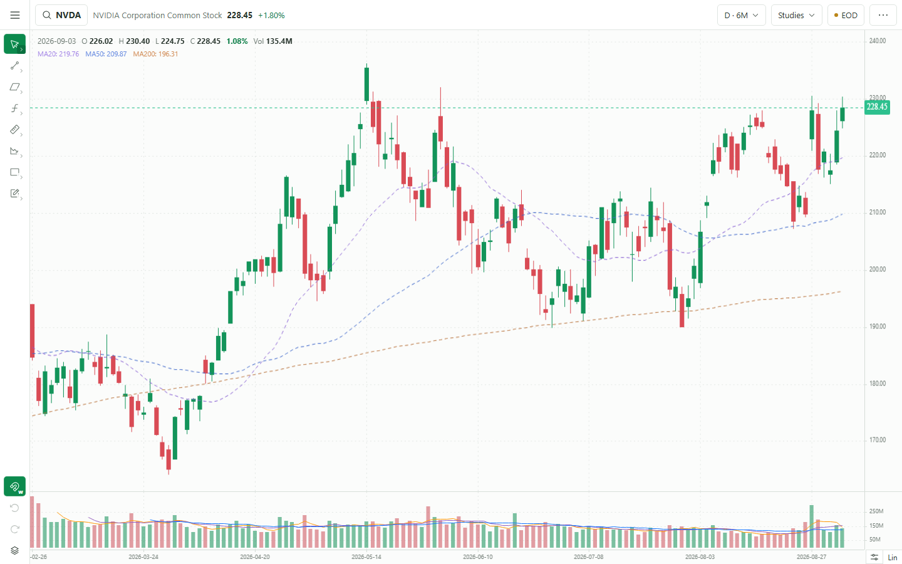
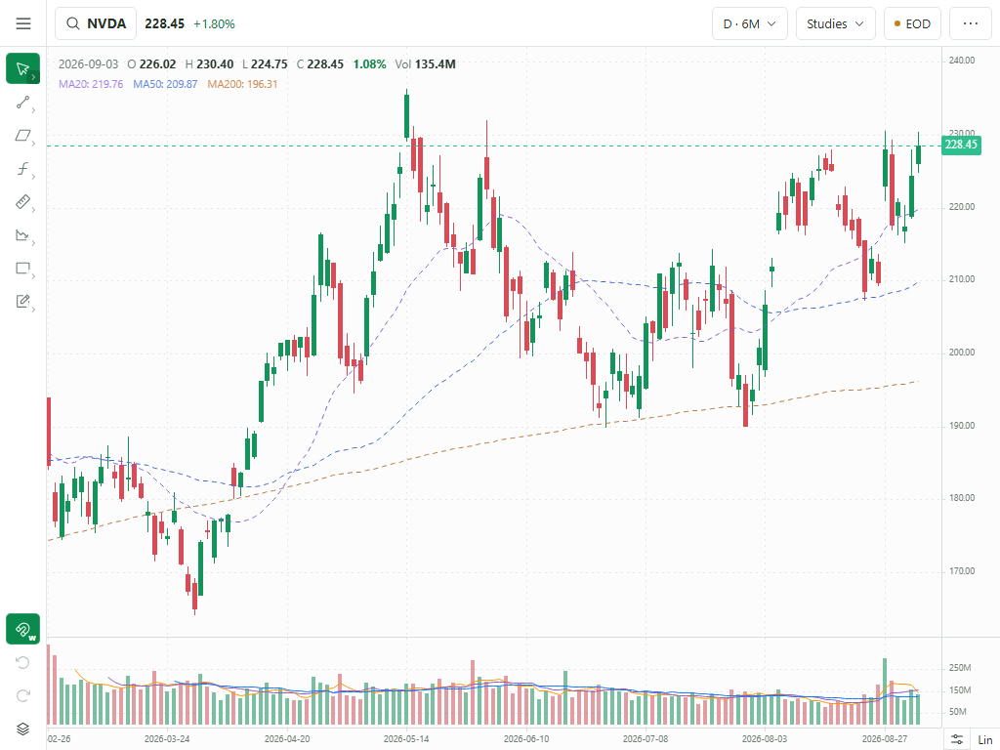
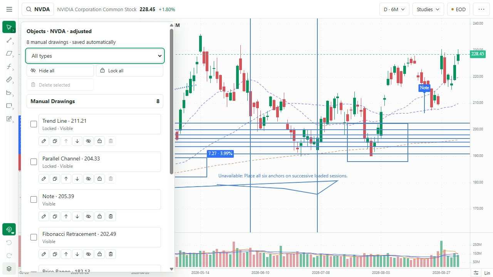
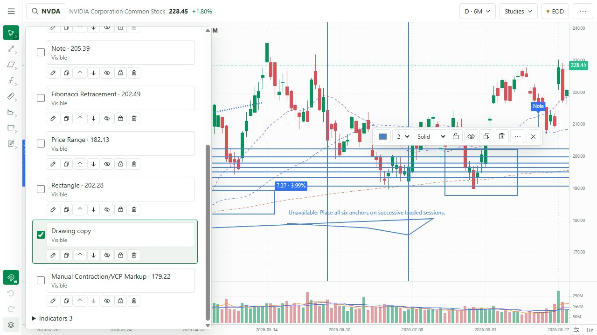
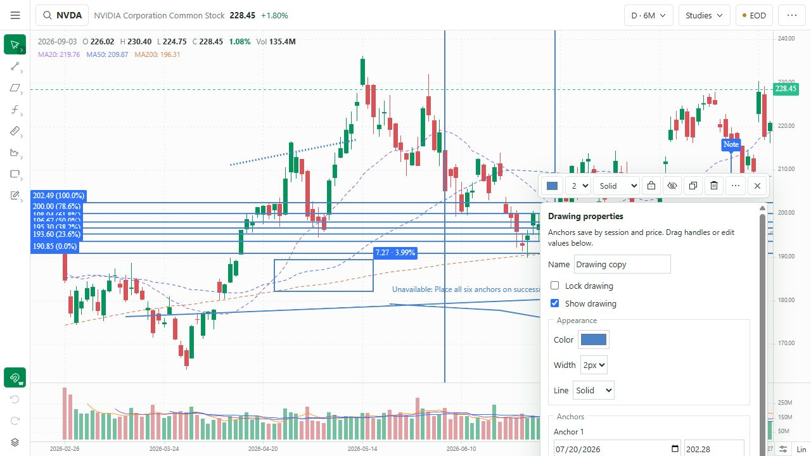
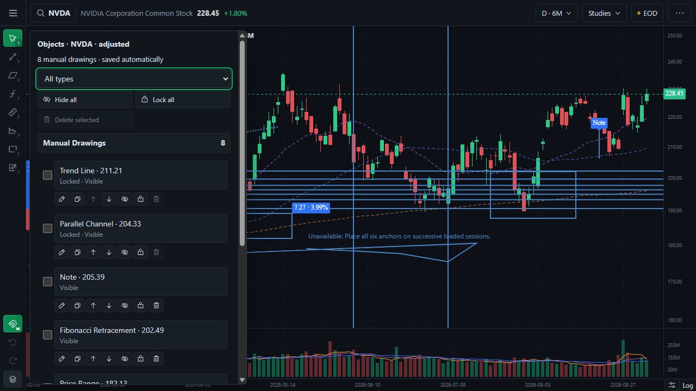

# Phase 2C — shared drawing lifecycle

Status: implemented and validated; awaiting the Gate 2C owner decision. PR #2 remains draft and unmerged.

Baseline: approved Gate 2B commit `fc0f88a`.

## Delivered behavior

- Drawing placement is one-shot by default and returns to Select. `Keep Drawing`, available inside every group flyout, immediately starts the same tool again after a completed drawing and persists as a device preference.
- Escape has two stages: the first press removes an unfinished overlay while leaving the chosen tool active; the next press returns to Select and clears contextual editing. Delete and Backspace remove selected unlocked drawings. Ctrl/Cmd+Z, Ctrl/Cmd+Shift+Z, and Ctrl+Y drive drawing history.
- Manual objects preserve KLineChart anchor handles. Empty-chart deselection closes the contextual editor. Locked drawings remain inspectable and selectable while mutation and deletion controls are disabled.
- A floating contextual toolbar follows the selected anchors and stays within the chart width. It exposes colour, 1–4 px width, solid/dashed/dotted style, lock, visibility, duplicate, delete, and More Settings. Double-click opens complete properties; right-click selects the object and exposes its complete action surface.
- More Settings exposes the meaningful name, state, appearance, exact session/price anchors, annotation text where applicable, tool evidence, and deletion. Completed changes enter the same history as direct manipulation.
- Magnet state remains one compact Off/Weak/Strong control, defaults to Weak, and applies to create, move, and resize. Holding Alt temporarily overrides every manual overlay to free placement; release or window blur restores the persisted mode.
- Objects remains a temporary overlay. Manual Drawings is collapsible and Indicators has its own section. The panel supports type filtering, multi-select, locate, meaningful type/price names, inline rename, duplicate, layer ordering, show/hide, lock/unlock, bulk visibility and locking, and confirmed bulk deletion with undo.
- History now retains 100 actions for each symbol/source/adjustment workspace in the active page session. Create, move, resize, style, rename, duplicate, lock, hide, reorder, and delete store exact before/after snapshots. A new edit clears redo; refresh intentionally resets history while drawings remain saved.
- Saved v1 objects receive the optional `displayName` field additively. Unknown and legacy overlays remain readable and editable. Existing geometry, IDs, styles, lock/visibility state, and tool data are retained.

## Representative lifecycle matrix

| Group | Browser representative | Result |
|---|---|---|
| Cursor | Select/Crosshair | Pass: normal navigation remains available; selection clears from empty chart/Escape |
| Lines | Trend Line | Pass: create, select, contextual style, properties, lock, history, persistence |
| Channels | Parallel Channel | Pass: multi-anchor create, select, lock, multi-select, persistence |
| Fibonacci | Fibonacci Retracement | Pass: create, restore, meaningful object entry |
| Measure & Trade | Price Range | Pass: create, rendered price/percentage evidence, restore |
| Patterns & Setups | Manual Contraction/VCP Markup | Pass: six-anchor create and explicit unavailable evidence for a deliberately non-session fixture |
| Shapes | Rectangle | Pass: create, locate, duplicate, double-click properties, layer insertion |
| Annotations | Note | Pass: one-point create, text-capable properties, restore |

The browser run created one representative in every currently available creation group and confirmed seven distinct canonical types in Objects. Cursor has no creation overlay. Tools deliberately deferred by Gate 2B remain deferred to Gate 2D.

## Automated validation

| Check | Result |
|---|---|
| Full JavaScript test suite | Pass: 50/50 |
| History capacity | Pass: exactly 100 retained past states after 130 mutations |
| Object helpers | Pass: duplicate inserts after source; reorder is bounded; bulk updates cannot replace IDs or renderer names |
| Exact restoration | Pass: undo/redo restores geometry, style, lock, visibility, and deletion snapshots |
| Redo invalidation | Pass: a new edit after undo clears future history |
| Persistence migration | Pass: optional names are additive; existing v1 records and unknown renderer data remain intact |
| Pages production build | Pass: `npm run build`, including TypeScript and static export |
| Local production build | Pass: `BRONTIDE_LOCAL_BUILD=1 node scripts/build.mjs`, including TypeScript and static export |
| Diff integrity | Pass: `git diff --check` |

Test command:

```powershell
node --test tests/*.test.mjs
```

The repository has no standalone lint script. Both production compilers completed TypeScript without diagnostics.

## Browser validation

| Workflow | Result |
|---|---|
| Single draw | Pass: completed Trend Line returned to Select and enabled undo |
| Keep Drawing and Escape | Pass: persistent Keep Drawing state, consecutive tool activation, unfinished cancellation, then Select |
| Context editing | Pass: colour/width/style controls, dotted preservation, viewport-clamped placement, More Settings |
| Selection | Pass: direct overlay selection, Objects selection/locate, two-object multi-select, empty clear |
| Object actions | Pass: rename surface, duplicate 7→8 objects, layer controls, visibility, locking, bulk controls |
| History | Pass: two-object lock undo/redo restored both objects; refresh reset controls while keeping saved objects |
| Persistence | Pass: reload restored 8/8 objects; NVDA→MRNA showed 0 objects; returning to NVDA restored 8/8 |
| Scale/theme | Pass: all 8 objects persisted and rendered through Lin→Log and light→dark |
| Direct manipulation contract | Pass: double-click opened complete properties; locked selection disabled edit/delete actions |
| Adjacent chart controls | Pass: search, symbol change, range/studies/status/viewport controls remained available |

Responsive evidence:

- 1440×900: exact screenshot dimensions; one 48 px command row, full-height 48 px rail, no clipped axes or unused panel.
- 1280×720: measured document 1280×720, chart and rail height 672 px, no horizontal or vertical page overflow, all visible command-bar children centred at y=24.
- 1024×768: exact screenshot dimensions; one command row, full-height rail, no page scrollbar, toolbar wrapping, or clipped scale controls.

## Screenshots













## Limitations and next gate boundary

- Gate 2C validates shared lifecycle behavior for the tools already exposed at Gate 2B. The eight approved but unfinished tools and specialised per-tool settings/calculation fixtures remain Gate 2D work.
- The deliberately free-form contraction browser example demonstrates explicit unavailable evidence because its clicks did not map to six successive loaded sessions. Fixed contraction calculations remain covered by the existing 20% → 10% → 5% fixture; broader specialised fixtures belong to Gate 2D.
- Phase 2E still owns the v2 overlay schema, timeframe visibility scope, mobile bottom sheets, corporate-action coverage, and explicit storage-failure suite.

The exact proposed Gate 2C release set is `app/ChartDashboard.tsx`, `app/DrawingContextToolbar.tsx`, `app/DrawingEditor.tsx`, `app/DrawingObjectsPanel.tsx`, `app/chart-workspace.css`, `lib/drawing-workspace.ts`, `lib/use-drawing-controller.ts`, `tests/drawing-workspace.test.mjs`, and this review packet with its six screenshots. It does not include the unrelated local `next.config.ts` or `output/` changes.

Approval authorizes Gate 2D only. It does not authorize merging PR #2, deploying Phase 2, or beginning Phase 3.
