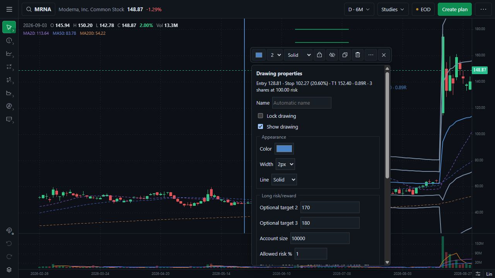
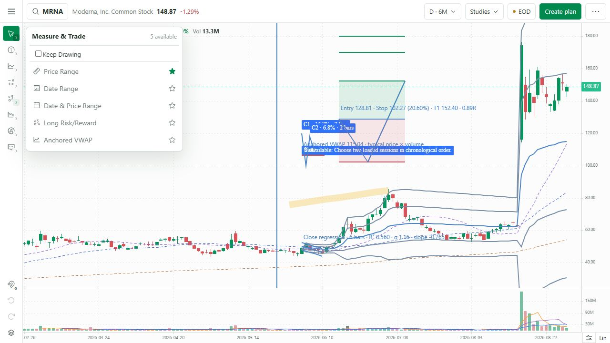
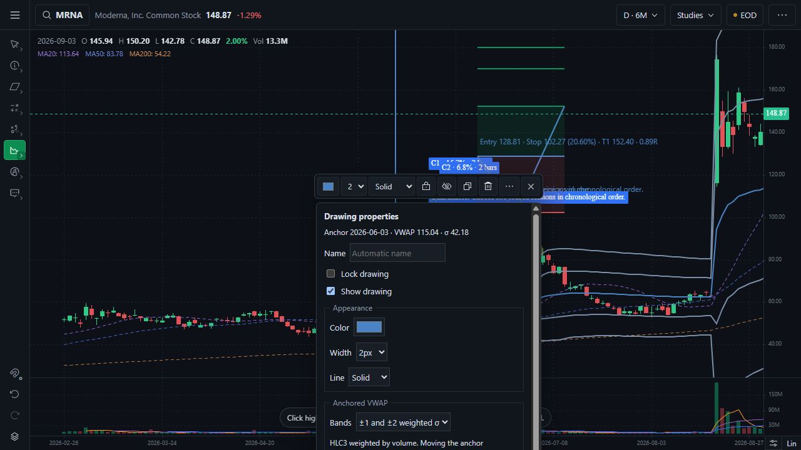
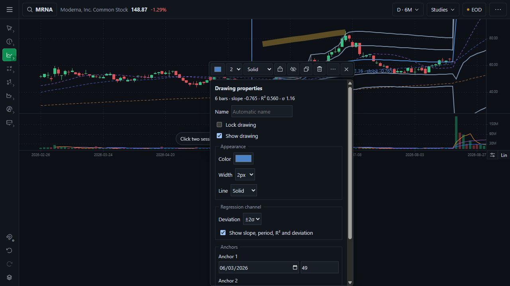
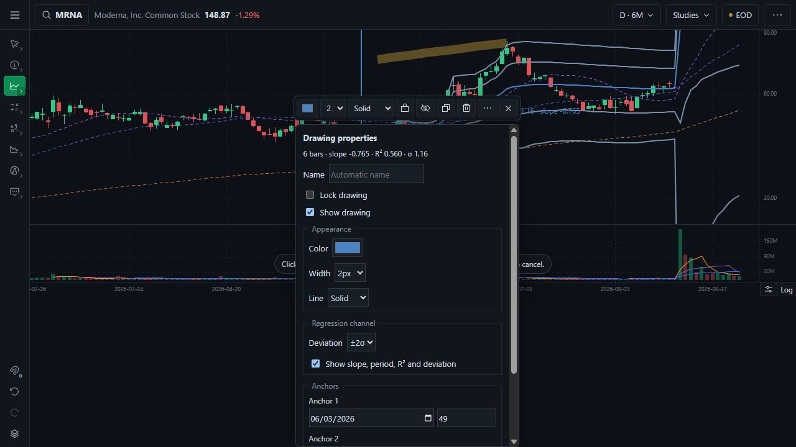
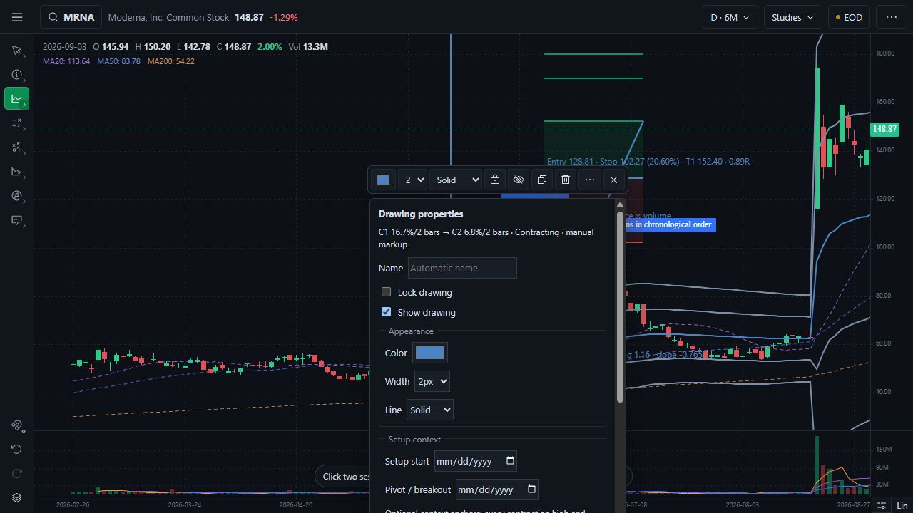
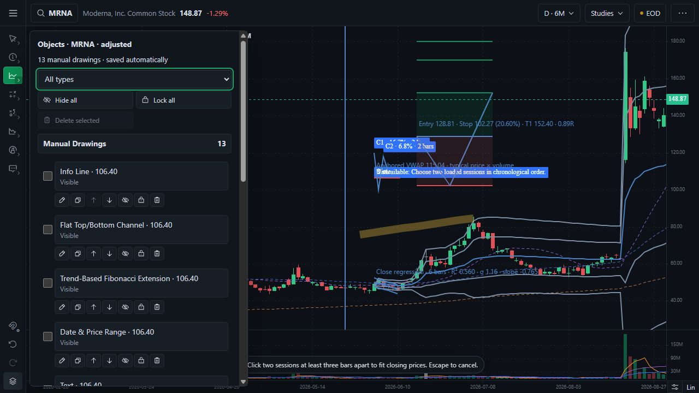
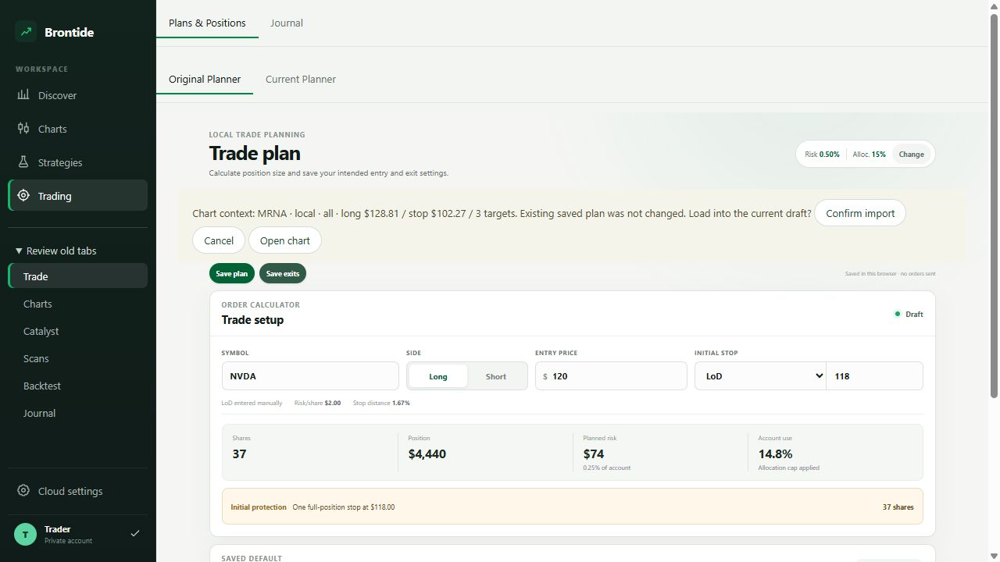
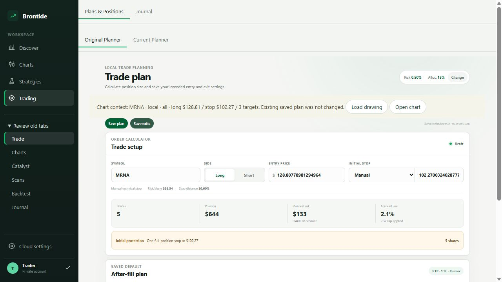

# Phase 2D — complete manual tool set and calculation fixtures

Status: implemented and validated; awaiting the Gate 2D owner decision. PR #2 remains draft and unmerged. `main` remains at `fd6e934c2085d4a1639246f2bbbd29c3525585ac`.

Baseline: approved Gate 2C commit `783e38f9982ac97260158c9785263ff178fa8f5e`.

## Delivered behavior

- All 29 approved tools now have one canonical access path across the eight fixed groups. Gate 2D completes Eraser, Info Line, Flat Top/Bottom Channel, Trend-Based Fibonacci Extension, Date & Price Range, Highlighter, Text, and Callout. The group totals are 2, 7, 3, 2, 5, 1, 5, and 4.
- Eraser removes the clicked unlocked object and records the deletion in drawing history. Locked objects remain protected; Undo restores the exact erased object.
- Long Risk/Reward exposes entry, stop, initial target, stop percentage, per-share risk, reward and R for as many as three targets, optional account/risk sizing, chart zones, and a confirmed handoff to the original Trade Planner. The standalone chart omits the handoff because it has no host planner.
- Manual Contraction supports two to five manually entered high/low pairs, deterministic C1–C5 labels, high, low, depth, inclusive bar duration, relative depth, optional setup/pivot dates, and add/remove controls. It makes no automatic VCP claim.
- Anchored VWAP uses cumulative HLC3 weighted by volume from one candle and can render no bands, ±1 weighted population deviation, or ±1 and ±2 bands. Invalid or unavailable price/volume data produces an explicit unavailable state.
- Regression Channel fits close prices against completed-session indices, defaults to ±1 population residual deviation, supports ±2, and exposes slope, period, deviation, and R². Lin/Log changes rendering while the calculation stays in price space.
- Info Line and Date & Price Range show combined price, percent, session, and calendar evidence. Flat channel has an adjustable fill. Fibonacci Extension has editable labelled ratios. Text and Callout have text, size, alignment, and background properties.

## Tool-by-tool lifecycle matrix

Key: `C` create, `Ca` cancel, `S` select, `M` move, `R` resize, `E` style/properties, `L` lock/unlock, `H` hide/show, `Dp` duplicate, `D` delete, `U` undo/redo, `Re` save/refresh/restore. `P` means pass. The 27 saved-object rows are individually executed subtests; they are not one shared assertion.

| Group | Tool | C | Ca | S | M | R | E | L | H | Dp | D | U | Re |
|---|---|---:|---:|---:|---:|---:|---:|---:|---:|---:|---:|---:|---:|
| Cursor | Select/Crosshair | — | P | P | — | — | — | — | — | — | — | — | — |
| Cursor | Eraser | — | P | P | — | — | — | P | — | — | P | P | P |
| Lines | Trend Line | P | P | P | P | P | P | P | P | P | P | P | P |
| Lines | Ray | P | P | P | P | P | P | P | P | P | P | P | P |
| Lines | Extended Line | P | P | P | P | P | P | P | P | P | P | P | P |
| Lines | Horizontal Line | P | P | P | P | P | P | P | P | P | P | P | P |
| Lines | Horizontal Ray | P | P | P | P | P | P | P | P | P | P | P | P |
| Lines | Vertical Line | P | P | P | P | P | P | P | P | P | P | P | P |
| Lines | Info Line | P | P | P | P | P | P | P | P | P | P | P | P |
| Channels | Parallel Channel | P | P | P | P | P | P | P | P | P | P | P | P |
| Channels | Regression Channel | P | P | P | P | P | P | P | P | P | P | P | P |
| Channels | Flat Top/Bottom Channel | P | P | P | P | P | P | P | P | P | P | P | P |
| Fibonacci | Fibonacci Retracement | P | P | P | P | P | P | P | P | P | P | P | P |
| Fibonacci | Trend-Based Fibonacci Extension | P | P | P | P | P | P | P | P | P | P | P | P |
| Measure & Trade | Price Range | P | P | P | P | P | P | P | P | P | P | P | P |
| Measure & Trade | Date Range | P | P | P | P | P | P | P | P | P | P | P | P |
| Measure & Trade | Date & Price Range | P | P | P | P | P | P | P | P | P | P | P | P |
| Measure & Trade | Long Risk/Reward | P | P | P | P | P | P | P | P | P | P | P | P |
| Measure & Trade | Anchored VWAP | P | P | P | P | P | P | P | P | P | P | P | P |
| Patterns & Setups | Manual Contraction/VCP Markup | P | P | P | P | P | P | P | P | P | P | P | P |
| Shapes | Rectangle | P | P | P | P | P | P | P | P | P | P | P | P |
| Shapes | Circle | P | P | P | P | P | P | P | P | P | P | P | P |
| Shapes | Brush | P | P | P | P | P | P | P | P | P | P | P | P |
| Shapes | Highlighter | P | P | P | P | P | P | P | P | P | P | P | P |
| Shapes | Arrow | P | P | P | P | P | P | P | P | P | P | P | P |
| Annotations | Text | P | P | P | P | P | P | P | P | P | P | P | P |
| Annotations | Note | P | P | P | P | P | P | P | P | P | P | P | P |
| Annotations | Price Note/Label | P | P | P | P | P | P | P | P | P | P | P | P |
| Annotations | Callout | P | P | P | P | P | P | P | P | P | P | P | P |

Browser evidence additionally exercised creation for every newly completed tool, a continuous Highlighter drag, Eraser 11→10 objects followed by Undo 10→11, exact-anchor edits, two-to-five contraction controls, settings changes, Lin/Log stability, refresh restoration, and the confirmed Trade Plan import.

## Fixed calculation fixtures

| Fixture | Expected | Observed |
|---|---|---|
| Combined range, 10→20 across Fri–Tue | +10, +100%, 3 inclusive sessions, 2 intervals, 4 calendar days | Exact pass |
| Long risk, entry 100 / stop 95 / targets 110, 115, 120 | risk 5, stop 5%, 2R / 3R / 4R; $10,000 × 1% permits 20 shares | Exact pass |
| Contractions 100→80, 100→90, 100→95 | 20%, 10%, 5%; 2 bars each; relative depth 0.5 then 0.5; tightening | Exact pass |
| Contraction limits | C1–C5 accepted; sixth pair rejected; removal deterministically ends at C4 | Exact unit and browser pass |
| VWAP, HLC3 10×100 then 12×300 | current 11.5; weighted σ `sqrt(0.75)` = 0.866025; upper1 12.366025; lower2 9.767949 | Exact pass within `1e-12` |
| Regression closes 2, 1, 4 | centre 1.333333, 2.333333, 3.333333; slope 1; σ `sqrt(8/9)` = 0.942809; period 3; R² `3/7` = 0.428571 | Exact pass within `1e-10`/`1e-12` |

Invalid ordering, nonpositive risk prices, dates outside loaded history, malformed closes, and missing/invalid VWAP volume all pass explicit unavailable/error fixtures.

## Automated validation

| Check | Result |
|---|---|
| Full JavaScript suite | Pass: 82/82, including 27 separately named saved-object lifecycle subtests |
| Canonical inventory | Pass: 29 unique IDs, labels, icons, and renderer owners across eight fixed groups |
| Fixed numerical fixtures | Pass: range, risk/R/position size, 2–5 contractions, VWAP bands, regression centre/deviation/slope/period/R² |
| TypeScript | Pass: `npx tsc --noEmit` |
| Pages production build | Pass: `npm run build`, TypeScript and static export |
| Local production build | Pass: `BRONTIDE_LOCAL_BUILD=1 node scripts/build.mjs`, TypeScript and static export |
| Diff integrity | Pass after removing one trailing-space diagnostic |

## Browser validation

| Workflow | Result |
|---|---|
| Complete inventory | Pass: browser DOM reported exact group totals 2/7/3/2/5/1/5/4 and every approved label |
| New tool creation | Pass: Info Line, Flat Channel, Fibonacci Extension, Date & Price Range, Text, Callout, and Highlighter created and restored; Eraser removed the clicked object |
| Eraser history | Pass: 11 objects → 10 after erase → 11 after Undo |
| Risk/Reward | Pass: three targets, per-share risk, stop %, R, optional account/risk sizing, and chart zones rendered; full-workspace handoff retained values |
| Trade Plan handoff | Pass: routed to Original Planner, showed chart context, required inline confirmation, then imported MRNA, Long, entry 128.8077898, stop 102.2700324, Manual stop, and targets 152.3969/170/180 |
| Manual Contraction | Pass: exact 120→100 and 118→110 fixture rendered C1 16.7%/2 bars and C2 6.8%/2 bars, 41% of prior; add disabled at five and removal renumbered to four |
| Anchored VWAP | Pass: 2026-06-03 anchor rendered current VWAP 115.04 and weighted σ 42.18; band selector persisted ±1/±2 |
| Regression | Pass: 2026-06-03→2026-06-10 rendered 6 bars, slope −0.765, R² 0.560, σ 1.16; ±2 persisted; evidence stayed byte-for-byte equal through Lin→Log |
| Persistence/isolation | Pass: a fresh full-workspace page restored MRNA drawings and settings; NVDA remained a distinct drawing context |
| Themes and adjacent chart controls | Pass: completed tools and properties rendered in dark and light themes; symbol, range, studies, status, viewport, scale, and navigation remained usable |

## Screenshots

## Known limitations and next gate boundary

- Gate 2D is limited to the approved Long Risk/Reward tool. A short-position drawing is not part of the canonical Phase 2 inventory.
- The standalone `/charts/` route has no parent planning workspace, so it omits Send to Trade Plan. The full `/` workspace provides and validates the handoff.
- Phase 2E still owns timeframe-safe v2 persistence, corporate-action coordinate coverage, explicit storage-failure handling, and the complete desktop/mobile responsive and accessibility suites. Existing v1 saved drawings remain compatible in Gate 2D.
- Phase 2F remains the final integrated acceptance packet. Gate 2D approval authorizes Gate 2E only; it does not authorize a merge, deployment, or Phase 3.

The proposed Gate 2D change set is limited to the drawing registry/renderers/controller, the contextual properties and chart/plan handoff UI, calculation and lifecycle tests, and this packet with its screenshots. The unrelated local `next.config.ts` and untracked `output/` remain excluded.
