# Phase 2E — persistence, coordinates, responsive and accessibility completion

Status: implemented and validated; included in the complete Phase 2 review package. PR #2 remains draft and unmerged. `main` remains at `fd6e934c2085d4a1639246f2bbbd29c3525585ac`.

Baseline: approved Gate 2D commit `63a2c5323ab4d495e755a3e87387c6ab6b616b17`.

## Delivered behavior

- Drawing persistence now uses an explicit version-2 document with source mode, canonical symbol, price-adjustment basis, timeframe visibility, save timestamp, and validated drawing data.
- A version-1 document migrates on read without deleting or modifying the old value. Identifiers, names, geometry, appearance, hidden state, and lock state are preserved.
- Daily and weekly charts share canonical daily-session coordinates. Weekly rendering maps saved timestamps to their containing completed week without rewriting saved anchors.
- Daily/weekly interval selection is part of the existing range control. Weekly OHLCV uses first open, high/low extrema, last close, and summed volume.
- Raw and split/dividend-adjusted coordinates use distinct storage contexts. The application never silently converts a drawing between bases.
- Writes are debounced and verified. The drawing updates immediately in memory; saving reports `Saving…`, `Saved on this device`, or `Save failed`. A blocked, full, or unverifiable storage write produces a persistent visible warning.
- At compact widths the desktop rail becomes one `Draw` action and an equivalent bottom sheet. Tool groups, group menus, object management, contextual properties, active-tool state, and drawing cancellation remain available.
- The chart surface has an application role and an accessible name. Toolbar, rail, compact sheets, controls, and status messages expose names and keyboard focus.

## Persistence and coordinate evidence

| Scenario | Result |
|---|---|
| Version-1 migration | Pass: seeded v1 drawing produced a validated v2 document after reload; the v1 value remained byte-for-byte present |
| Geometry/state migration | Pass: id, name, timestamp/price anchors, style, lock, and hidden state were exact |
| Symbol scope | Pass: two NVDA drawings remained under NVDA; MRNA opened with zero objects and a separate context |
| Timeframe safety | Pass: a daily trend line appeared on Weekly through timestamp-to-week mapping; returning to Daily retained the original timestamps and prices |
| Weekly OHLCV | Pass: fixed fixture used first open, maximum high, minimum low, last close/timestamp, and summed volume |
| Adjustment basis | Pass: fixed corporate-action fixture stored raw price 100 and adjusted price 50 at the same timestamp under separate exact contexts |
| Lin/Log, range, zoom, resize | Pass: the serialized v2 drawing document remained byte-for-byte unchanged through Lin→Log, 6M→3M, viewport zoom, and resize |
| Pending write on context change | Pass: cleanup flush uses the state’s original key, so a symbol switch cannot redirect or drop its pending save |
| Conflict/corrupt/future data | Pass: context mismatch, invalid drawing data, duplicate IDs, and future schema versions are rejected rather than treated as empty valid data |
| Storage failure | Pass: forced `localStorage.setItem` failure retained the in-memory object, changed Objects to `Save failed`, changed status to `Check`, and displayed the failure warning |

The corporate-action fixture deliberately validates coordinate-basis agreement and isolation. Automatic price conversion is outside Phase 2 because it could silently change user geometry.

## Responsive browser evidence

| Viewport | Layout result |
|---|---|
| 1440×900 | 48 px rail, one 48 px top row, chart bounds `(48,48)–(1440,900)`, no overflow/overlap/clipping |
| 1280×720 | 48 px rail, one 48 px top row, chart bounds `(48,48)–(1280,720)`, no overflow/overlap/clipping |
| 1024×768 | 48 px rail, one 48 px top row, chart bounds `(48,48)–(1024,768)`, no overflow/overlap/clipping |
| 390×844 portrait | Rail hidden, 44 px `Draw` action visible, chart bounds `(0,48)–(390,844)`, no page overflow |
| 844×390 landscape | Rail hidden for limited height, 44 px `Draw` action visible, chart bounds `(0,48)–(844,390)`, no page overflow |

The portrait drawing sheet occupied `(0,414)–(390,844)` and its nested Lines sheet occupied `(0,430)–(390,844)`. Every visible button in both sheets measured at least 44×44 px. Touch placement created one saved trend line; a two-finger pinch in Select mode retained exactly one drawing and did not start another.

## Accessibility and regression results

- Desktop audit: 28 visible enabled controls, zero unnamed, zero clipped, zero below 24×24 px.
- Compact sheet audit: zero controls below 44×44 px.
- Chart command and drawing-tool landmarks were present; the injected chart canvas exposed an accessible application name.
- The first 24 Tab stops were named controls in logical command-bar then rail order. No focus stop fell onto the document body.
- Escape closed the interval menu and returned focus to `Time interval and range`.
- Ctrl/Command-Z and Ctrl/Command-Shift-Z restored exact duplicate/undo/redo counts of 2→1→2.
- Symbol selection, interval/range, studies, viewport, Lin/Log, theme, drawing selection, object management, and persistence remained operable.
- Browser console errors during the completed workflows: zero.

## Automated validation

| Check | Result |
|---|---|
| Full JavaScript suite: `node --test tests/*.test.mjs` | Pass: 87/87 |
| TypeScript: `npx tsc --noEmit` | Pass |
| GitHub Pages production build: `npm run build` | Pass: TypeScript and static export |
| Local production build: `BRONTIDE_LOCAL_BUILD=1 node scripts/build.mjs` | Pass: TypeScript and static export |
| Diff integrity: `git diff --check` | Pass; line-ending notices only |
| Lint | No lint script or lint configuration exists in this repository; TypeScript and both production builds completed their configured checks |

The five new tests raise the repository total from 82 to 87. They cover weekly aggregation and timestamp mapping, v1→v2 migration, exact storage context validation, verified-write failure, and raw/adjusted corporate-action coordinate isolation.

## Screenshots

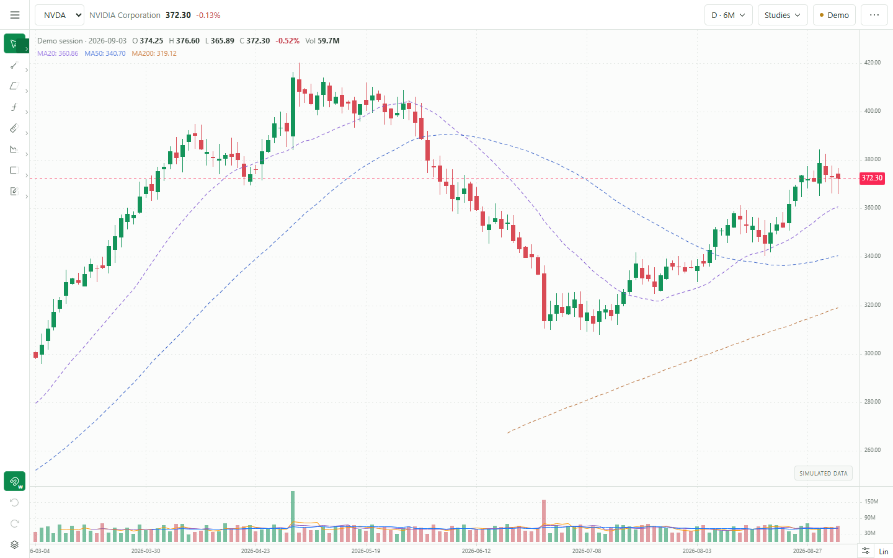

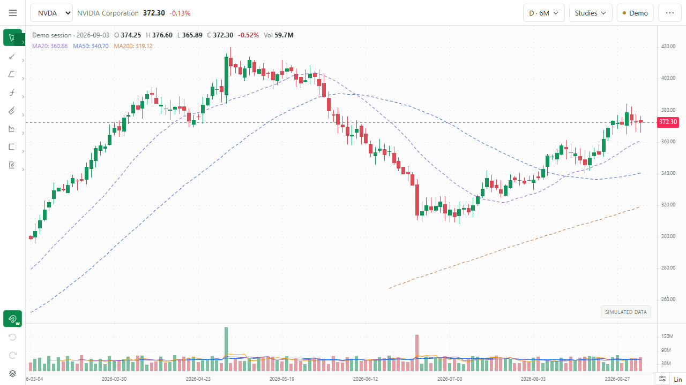

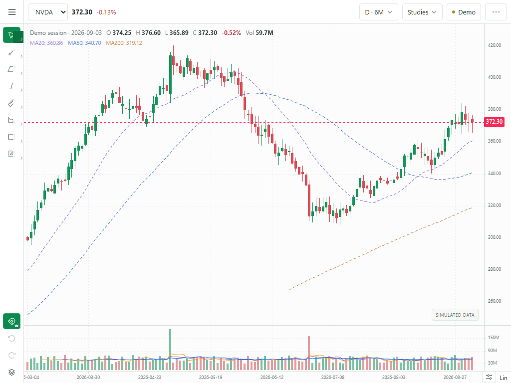

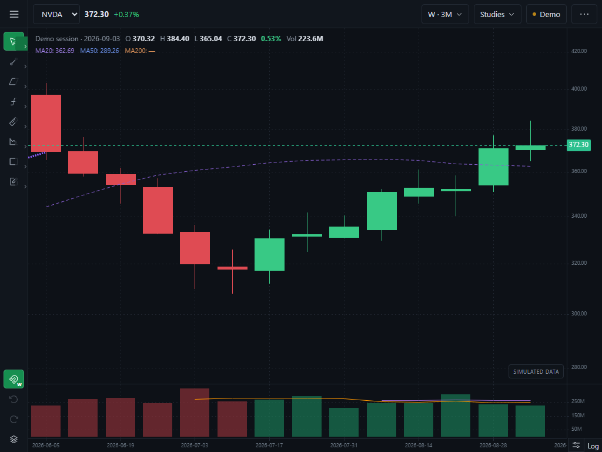

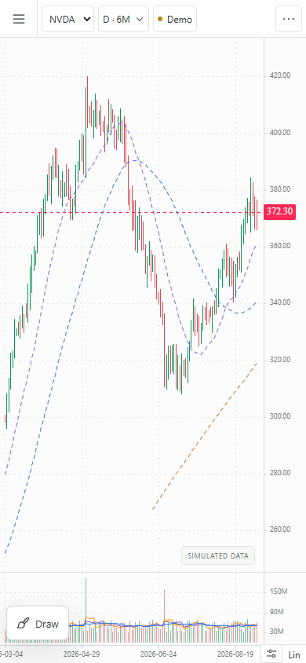

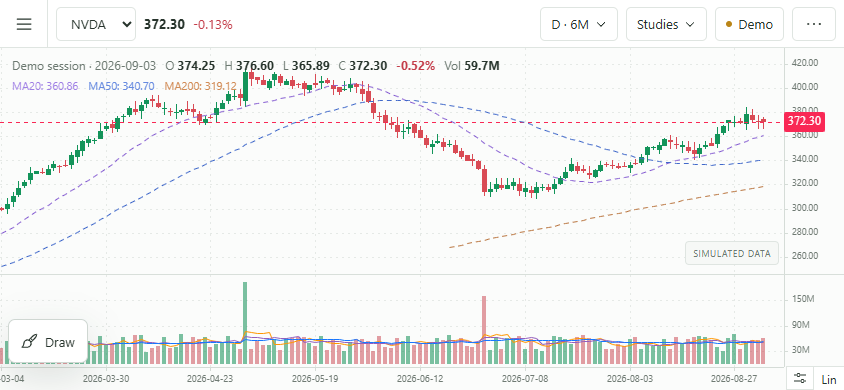

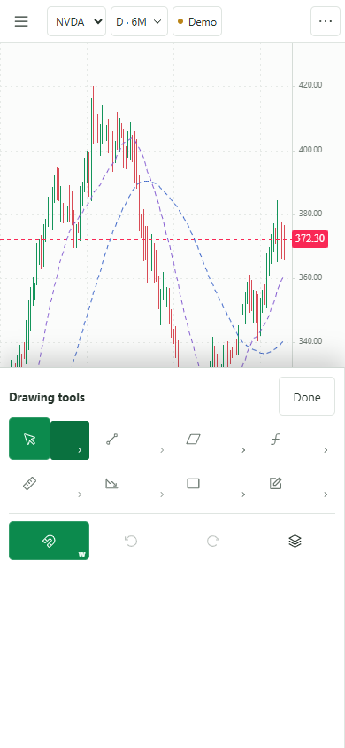

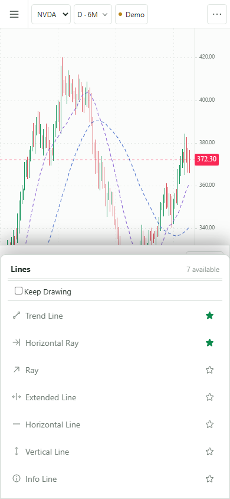

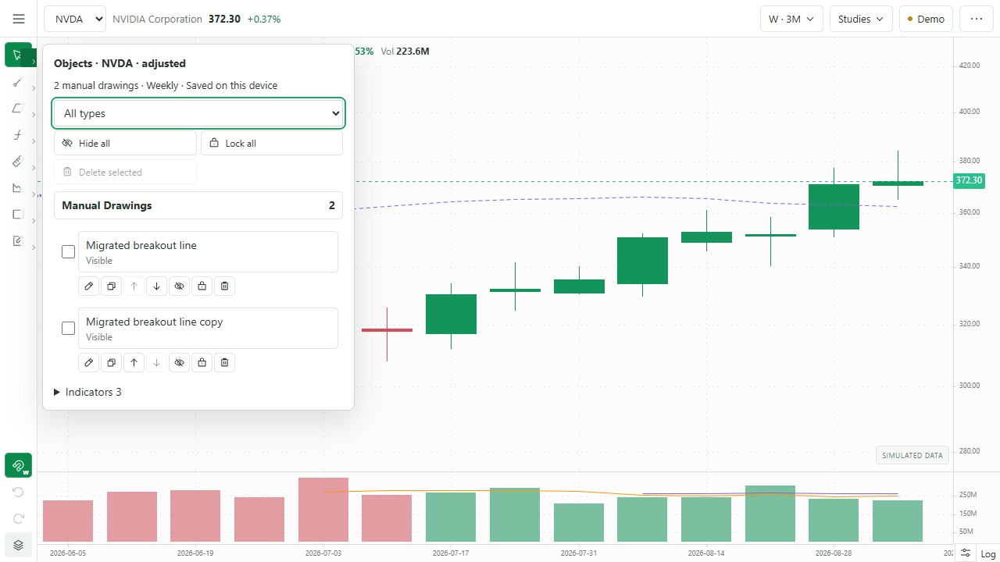

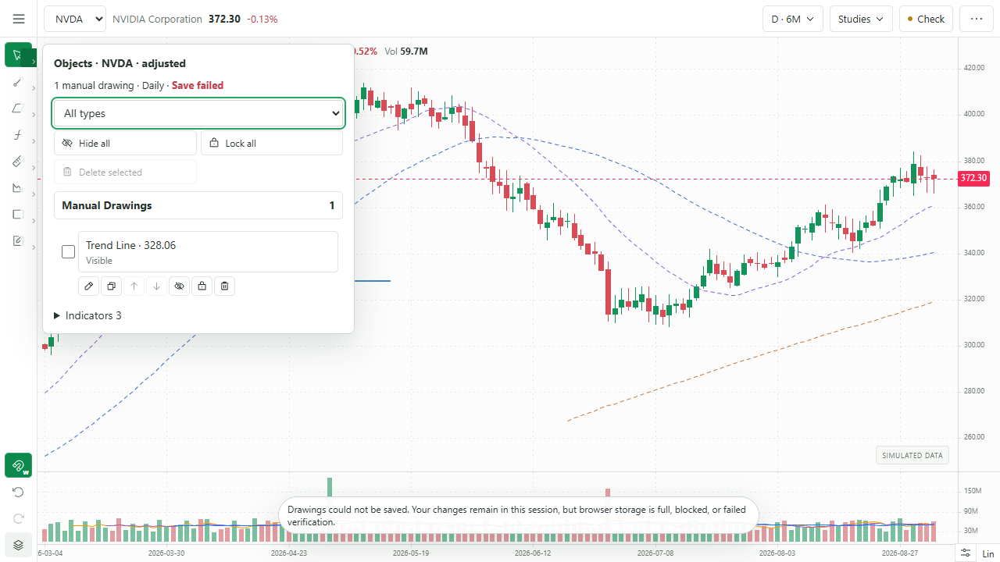

## Known limitations and boundary

- Persistence is intentionally current-device browser storage. There is no account sync.
- Version-1 values are retained as a recovery source after migration; the validated version-2 document becomes authoritative for subsequent reads.
- New drawings default to all timeframes. The schema supports future per-object Daily/Weekly visibility, but Phase 2 does not add a visibility editor.
- Adjustment contexts are isolated; drawings are not automatically converted after a split or adjustment-basis change.
- The fixed corporate-action fixture supplies both price bases. This Gate did not depend on the optional local market-data service.
- The existing candlestick renderer remains the chart type; the product has no separate chart-type selector to regress.

Gate 2E and the integrated Phase 2 acceptance suite are complete. PR #2 must remain unmerged until the owner approves the complete review package. That approval authorizes the Phase 2 merge only; Phase 3 still requires a separate instruction.

## Final UI review corrections

The owner withheld final approval and requested two Phase 2 corrections. Both are implemented and revalidated:

- The group-opening chevron now stays inside the 48 px desktop rail. Its idle surface is transparent, its active color is integrated with the quick-tool button, and the quick-tool center remains independently clickable. Geometry checks passed for every group in light and dark themes at 1440×900, 1280×720, and 1024×768.
- Portrait and landscape bottom sheets retain separate 44×44 px group openers. Every opener stays inside its sheet and no mobile control falls below 44×44 px.
- The built-in 5/10/20-period volume moving averages are disabled by passing an empty parameter list to the volume indicator. Volume bars and their colors are unchanged. The independent MA20/MA50/MA200 price-chart indicator and legend remain visible and unchanged.
- Regression after the correction: 87/87 tests, TypeScript, Pages production build, five viewport geometry checks, both themes, mobile target checks, and zero browser console errors all pass.

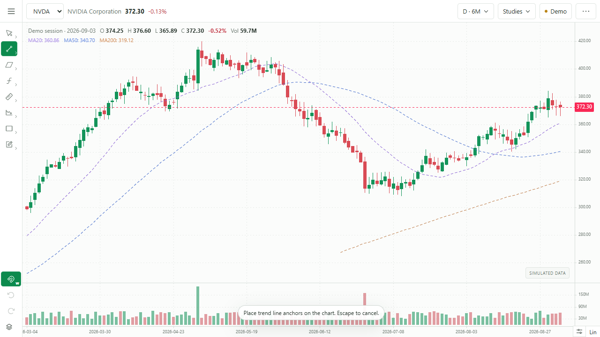

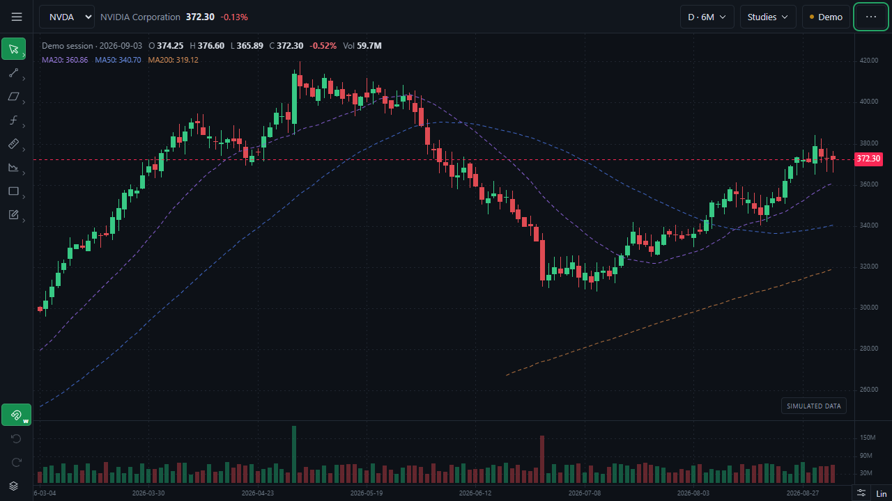

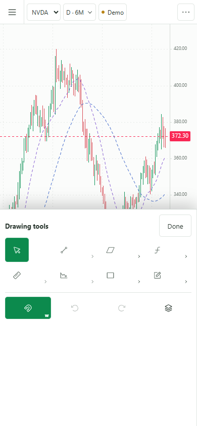
